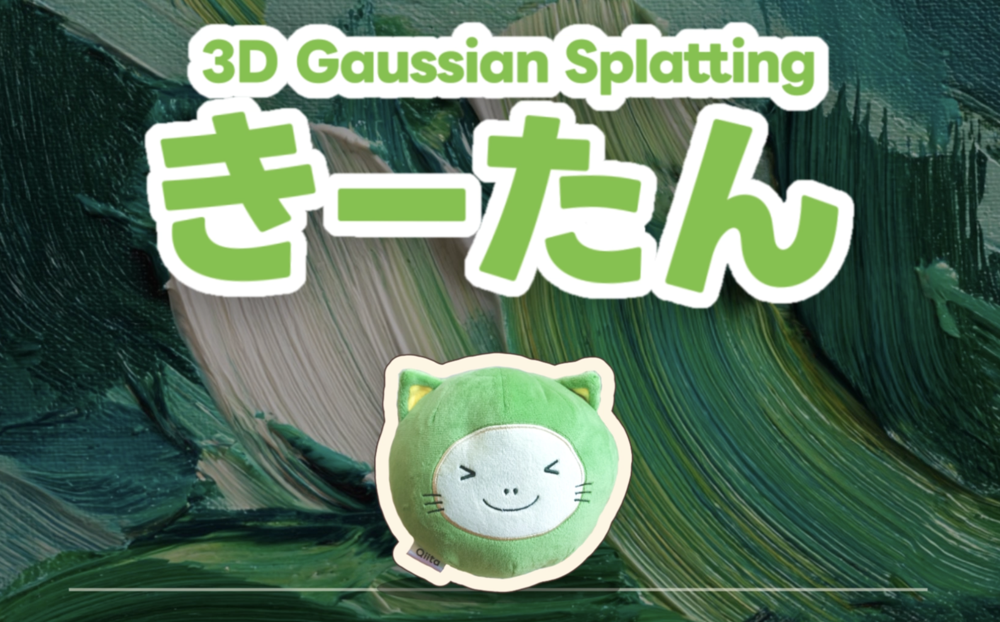
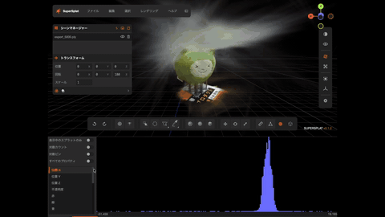
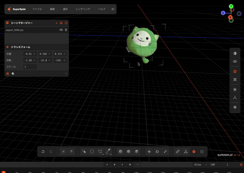
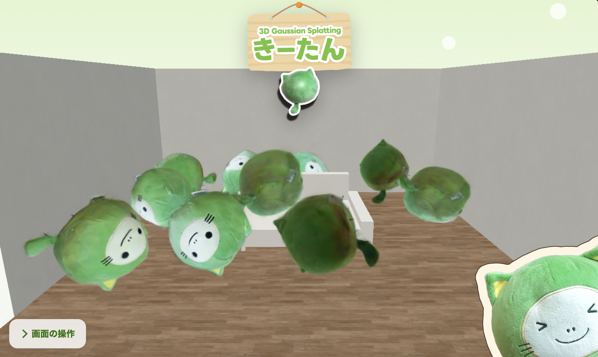

https://nyamadamadamada.github.io/GaussianSplatting/

# ３DGaussianSplattingきーたん

Qiitanを撮影した動画から3D Gaussian Splattingのモデルを作り、Webサイト上で降らせるまでのリポジトリです。
動作確認はApple SiliconのMacでのみ行っています。


## 構成

```
.
├── model/
│   ├── run_brush.sh   # 動画から学習し、.plyを書き出すスクリプト
│   ├── bin/
│   │   └── brush_app  # Brush本体。Gitで管理しない
│   ├── input/         # 撮影した動画を置く。Gitで管理しない
│   └── output/        # 学習の生成物。Gitで管理しない
└── web/               # Qiitan落下サイト。詳細は web/README.md
```

## 初期設定

```bash
# ffmpeg colmapインストール
brew install ffmpeg colmap

# brushインストール
cd model
curl -L -o /tmp/brush.tar.xz https://github.com/ArthurBrussee/brush/releases/download/v0.3.0/brush-app-aarch64-apple-darwin.tar.xz
tar -xJf /tmp/brush.tar.xz -C /tmp
mkdir -p bin
cp /tmp/brush-app-aarch64-apple-darwin/brush_app bin/
chmod +x bin/brush_app
./bin/brush_app --version
```

## ３Dモデル作成の手順

### 1. 撮影する

Qiitanの周りを動画撮影し、`model/input/input.mp4` に置きます。

### 2. 学習する

```bash
cd model
caffeinate -i ./run_brush.sh input/input.mp4 100 5000
```

引数は順に、動画ファイル、切り出すフレーム数、学習ステップ数です。
処理完了で `model/output/brush/export_<ステップ数>.ply` に、plyファイルが出力されます。

なお、`caffeinate -i`は処理中にMacがスリープにならないコマンドです。

**tip:学習の精度が甘い時**
- 引数を100→200、5000→10000にしてみてください。
- 時間の目安
    - 切り出すフレーム数：100、学習ステップ数:5000、動画1分 → 処理時間7分
    - 切り出すフレーム数：100、学習ステップ数:10000、動画1分 → 処理時間30分


### 3. 背景を削除する

[SuperSplat](https://superspl.at/editor) で.plyを開き、Qiitan以外を削除して「SPZ 3（レガシー gzip）」で書き出します。
書き出したファイルは `web/public/models/` に置き、`web/src/main.ts` の `SPLAT_URL` をそのファイル名に変えます。

| Qiitan以外を選択して削除 | 背景が消えたQiitan |
|---|---|
|  |  |

### 4. Webサイトで表示する

```bash
cd web
npm install
# 動作確認
npm run dev
# デプロイ時
npm run build      # 型チェックと本番ビルド。直下の docs/ に出力
npm run preview    # ビルド成果物の確認
```

学習したQiitanが部屋に降ってきます。


